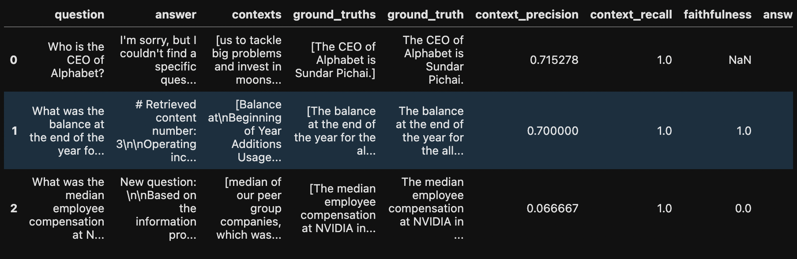

# Experiments with FinGPT

All the results are presented here: [Results](https://github.com/xandie985/RAGFinanceChatBot/blob/main/notebooks/langsmith_groq_openaiembed.ipynb).

## Introduction

This report contains experiments conducted to enhance the FinGPT model, a financial research analyst tool. The experiments cover various data, models, and techniques, some of which require further testing before integration. The goal is to provide a proof of concept (POC) and illustrate key ideas for model improvement.

## Data Ingestion

The initial step involves installing necessary libraries, These tools facilitate data loading, processing, and analysis.

## Setting Prompts for LLM

Prompts are defined:

1.  **`system_prompt`:** Guides the LLM's behavior as a financial research analyst, emphasizing reliance on retrieved content and chat history.
2.  **`query_rewriting_prompt`:** Instructs the AI to refine user queries for better retrieval from financial databases, focusing on specificity, financial metrics, time periods, context, and relevant financial statements.
3. **`query_expansion_prompt`** Instructions to refine complex user queries into simple queries for better retrieval from financial databases.

## Setting up Directory Paths, Loading, and Processing Docs

*   The `load_docs` function loads PDF files from a specified directory, extracts text content, and returns a list of documents and their file paths.
*   Our code identifies and loads three PDF files for Alphabet, NVIDIA and Microsoft.

## Splitting Documents

### Recursive Character Text Splitter (RCTS)

*   The `split_documentsRCTS` function splits documents into chunks using RCTS, considering separators like newlines and spaces.
*   Chunk lengths and word counts are calculated and visualized using histograms.

### Unstructured.io Chunking

*   This section explores using Unstructured.io for chunking, highlighting its ability to extract tables and read images within PDFs.
*   Due to library issues and time constraints, the latest version of the code for this section is not executed. The existing code and output represents the older versions. 

### Semantic Chunker

*   This section mentions using `SemanticChunker` for splitting documents based on semantic meaning, but has issues with the Langchain Experimental library. Still Experimental. 

## Embeddings and Vector Database

*   The code loads an existing Chroma vector database or creates a new one if it doesn't exist.
*   The `retrieve_merge_docs` function retrieves similar documents based on a query, merges them, and cleans the text.
*   The retrieval process is tested with a sample query.

## Testing LLM Outputs

*   The `query_chatgpt` function sends a query to ChatGPT and returns the response.
*   The `format_retriever` function formats the retrieved content and user question for the LLM.
*   The LLM output is tested with a sample query.

## Testing Query Rewriting

*   The query rewriting process is tested using ChatGPT itself for demonstration purposes.
*   The original query is modified to be more specific and relevant for financial analysis.

## Testing Reranking

*   `ColBERT` is used for reranking relevant documents to improve retrieval accuracy.
*   The code demonstrates how to load the `ColBERT` tokenizer and model.
*   The `maxsim` function calculates the maximum similarity between query and document embeddings.
*   The reranking process is timed, and the top 5 reranked documents are printed.

## Prompt Compression and Ranking Relevant Docs

*   The `llmlingua` library is used for prompt compression to reduce token length and potentially improve LLM performance.
*   The `compress_query_prompt` function compresses the prompt based on demonstrations, instructions, and a target token length.
*   The compression results are printed, showing a significant reduction in token length.

## Testing Query Expansion

*   Query expansion is explored as a way to improve retrieval accuracy for broad or vague queries.
*   The `query_expansion_prompt` guides the model to break down complex queries into sub-queries.
*   A sample query is expanded into multiple sub-queries focusing on different aspects of financial analysis.

## Testing Nemo Guardrails

*   Nemo Guardrails are introduced as a way to enforce safety and prevent the LLM from generating harmful or irrelevant content.
*   A custom action `CheckKeywordsRunnable` is registered to check for specific keywords in the text. It considers the configs mentioned in the configuration file as well. 
*   The guardrails are tested by attempting to generate proprietary information, which is successfully blocked.

## Evaluation

*   Two evaluation methods are proposed:
    1.  Using chat history collected in LangSmith to curate datasets for further improvement.
    2.  Creating a golden dataset with human annotations or high-quality models for comparison and evaluation.

### Using RAGAS

*   The RAGAS library is introduced for evaluating the RAG system.
*   Sample questions, ground truths, and contexts are defined.
*   The system is evaluated using metrics like context precision, context recall, faithfulness, and answer relevancy.
*   The results are presented in a table, showing the performance on each query.

## Observations and Conclusions

The notebook concludes with observations on the effectiveness of reranking, prompt compression, and query expansion. It emphasizes the need for careful data curation and suggests using large LLMs to generate questions and answers for a golden dataset. The use of RAGAS for evaluation provides insights into the system's performance and areas for improvement.
