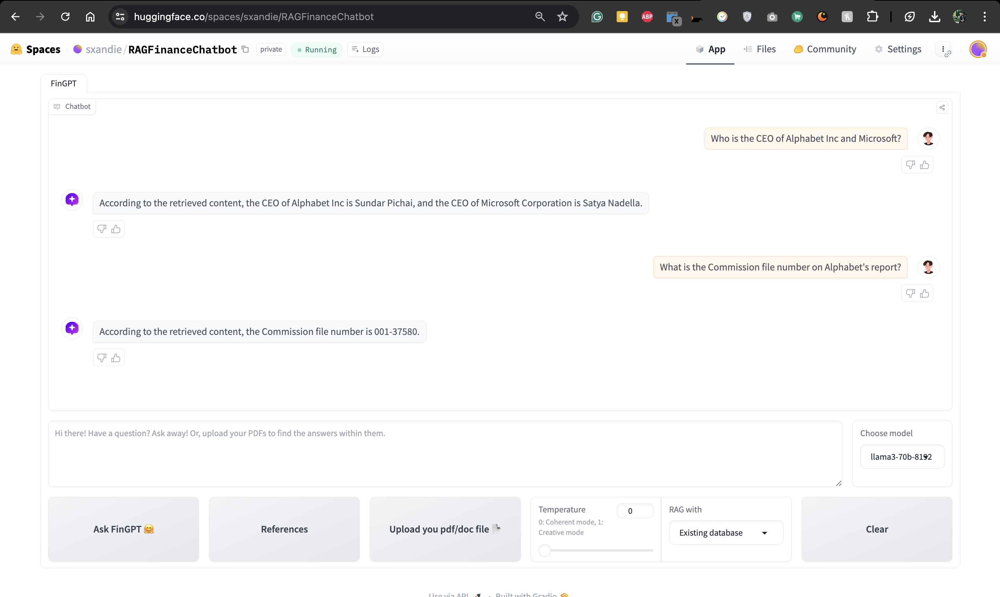

# Finance Q&A Chatbot Development

## Objective

Develop a generative Q&A chatbot that provides factual answers to user queries by referring to a knowledge base created from the PDF files of financial reports from major public companies. The chatbot should use proper grounding techniques to minimize hallucinations and ensure the accuracy of the information.

## Problem Statement

- Develop a generative Q&A chatbot capable of answering questions related to financial reports of large public companies.
- The chatbot should utilize a knowledge base derived from the provided PDF files of financial reports.
- Ensure the chatbot is grounded in the knowledge base to minimize hallucinations and provide accurate responses.

## Data

Use PDF files containing financial reports from major public companies:

- [Alphabet 2023](https://abc.xyz/assets/investor/static/pdf/20230203_alphabet_10K.pdf)
- [Microsoft 2023](https://www.microsoft.com/investor/reports/ar23/)
- [NVIDIA 2023](https://s201.q4cdn.com/141608511/files/doc_financials/2023/ar/2023-Annual-Report-1.pdf)


## Must Visit Presentation 
[Presentation](https://www.canva.com/design/DAGKqty7me8/9lvjzDmV2mrsaegoWZjz9Q/view?utm_content=DAGKqty7me8&utm_campaign=designshare&utm_medium=link&utm_source=editor)

## Features


## Technologies Used

- **Backend:** HTTP Server for serving the backend API.
- **Frontend:** Gradio for an interactive user interface.
- **Cloud Services:** Amazon Web Services (AWS) for deployment.
- **CI/CD:** GitHub Actions for Continuous Integration, Continuous Delivery, and Continuous Deployment.
- **RAG Model Evaluation:** RAGAS Library for model evaluation.
- **Model Monitoring:** LangchainSmith for model monitoring.
- **Language Models:** GPT-3.5-Turbo, LLaMA3-70B-8192, and Mixtral-8x7B-32768.
- **Data Version Control:** DVC for storing documents and vector databases in an AWS S3 bucket.
- **Containerization:** Docker for containerizing applications.
- **Container Orchestration:** Docker Compose for defining and running multi-container Docker applications.
- **Guardrails:** Nemo GuardRails for implementing safety and compliance measures in AI models.


## Architecture


## Demo Testing on HuggingFace Available

You can directly test the Chatbot here
```bash
 https://huggingface.co/spaces/sxandie/RAGFinanceChatbot
```



## Run Locally

1. Clone the project:

    ```bash
    https://github.com/xandie985/RAGFinanceChatBot.git
    ```

2. Create a `.env` file in the `frontend/src/.env` folder with the following content:

    ```env
    HF_TOKEN=
    OPENAI_API_KEY=
    GROQ_API_KEY=
    LANGCHAIN_API_KEY=
    PINECONE_API_KEY=
    ```

### Set Up and Run the App with Docker

1. Open Docker Desktop application.

2. Build the Docker container:

    ```bash
    docker-compose build
    ```

3. Run the Docker container:

    ```bash
    docker-compose up
    ```

4. Open your preferred browser and navigate to [http://localhost:8000/](http://localhost:8000/) & [http://localhost:7860/](http://localhost:7860/)to start using the application.


## Project Structure

- **frontend/**: Contains files related to the Gradio-based frontend application, including the main script (`app.py`), configuration files, data, and Dockerfile.

- **backend/**: Includes the backend server for handling API requests, with the main script (`serve.py`), configuration files, requirements, and Dockerfile.

- **notebooks/**: Contains Jupyter notebooks for experimentation, including initial assumptions, data processing, and testing.

- **pytest/**: Directory for pytest with example test files.

- **docker-compose.yaml**: Configuration file for defining and running multi-container Docker applications.

- **.dvc/**: Contains DVC configuration files for data version control, including `.gitignore` and `config`.


```bash
📦 
├─ .dvc
│  ├─ .gitignore
│  └─ config
├─ .dvcignore
├─ .github
│  └─ workflows
│     └─ main.yml
├─ .gitignore
├─ HELPER.md
├─ README.md
├─ backend
│  ├─ Dockerfile
│  ├─ configs
│  │  └─ app_config.yml
│  ├─ requirements.txt
│  └─ serve.py
├─ docker-compose.yaml
├─ frontend
│  ├─ Dockerfile
│  ├─ app.py
│  ├─ configs
│  │  └─ app_config.yml
│  ├─ data
│  │  ├─ docs
│  │  │  ├─ alphabet-2023.pdf
│  │  │  └─ microsoft-2023.pdf
│  │  └─ vectordb
│  │     └─ processed
│  │        └─ chroma
│  │           ├─ chroma.sqlite3
│  │           └─ f926420f-492c-48a8-a50b-448a3a18a87a
│  │              ├─ data_level0.bin
│  │              ├─ header.bin
│  │              ├─ index_metadata.pickle
│  │              ├─ length.bin
│  │              └─ link_lists.bin
│  ├─ images
│  │  ├─ chatbot.png
│  │  └─ user.png
│  ├─ requirements.txt
│  └─ src
│     ├─ __init__.py
│     ├─ finbot.py
│     ├─ load_config.py
│     ├─ prepare_bgesmall_vectordb.py
│     ├─ prepare_openAIEmbeddings_vectordb.py
│     ├─ ui_settings.py
│     ├─ upload_data_manually.py
│     └─ upload_file.py
├─ log.txt
├─ notebooks
│  ├─ config
│  │  └─ config.yml
│  ├─ langsmith_groq_openaiembed.ipynb
│  ├─ processed_data
│  │  ├─ chroma.sqlite3
│  │  └─ f01ca3c9-e477-42c2-a127-6c44abc22708
│  │     ├─ data_level0.bin
│  │     ├─ header.bin
│  │     ├─ index_metadata.pickle
│  │     ├─ length.bin
│  │     └─ link_lists.bin
│  └─ test.ipynb
└─ pytest
   └─ dummy_test.py
```

## Deployment & CI/CD Pipeline Github Actions
The below steps followed to do perform deployment.
Note: I used my AWS account for deployment but have since removed all resources to avoid incurring charges.

#### 1. Login to AWS console.
#### 2. Create IAM user for deployment

```bash
#with specific access
1. EC2 access : It is virtual machine
2. ECR: Elastic Container registry to save your docker image in aws

#Description: About the deployment

1. Build docker image of the source code
2. Push your docker image to ECR
3. Launch Your EC2 
4. Pull Your image from ECR in EC2
5. Lauch your docker image in EC2

#Policy:
1. AmazonEC2ContainerRegistryFullAccess
2. AmazonEC2FullAccess
```

#### 3. Create ECR repo to store/save docker image
```bash
- Save the URI:
```
#### 4. Create EC2 machine (Ubuntu)
#### 5. Open EC2 and Install docker in EC2 Machine:

```bash
#optinal
sudo apt-get update -y
sudo apt-get upgrade
#required
curl -fsSL https://get.docker.com -o get-docker.sh
sudo sh get-docker.sh
sudo usermod -aG docker ubuntu
newgrp docker
```
#### 6. Configure EC2 as self-hosted runner:

### 7. Setup github secrets:
```bash
AWS_ACCESS_KEY_ID=
AWS_SECRET_ACCESS_KEY=
AWS_REGION = us-east-1
AWS_ECR_LOGIN_URI = 
BACKEND_ECR_REPOSITORY_NAME=
FRONTEND_ECR_REPOSITORY_NAME=
```


### Run Tests
These tests ensure that the code handles different scenarios correctly:
- Producing valid results for correct input ranges.
Run the tests:

```bash
pytest
```


## Data Version Control (DVC) Setup

The dataset & Vector database has been added to the AWS S3 bucket.
Managing Data Versions with DVC

To manage the data versions with DVC using the below commands:

1. **Add a remote storage**:
    ```bash
    dvc remote add -d myremote s3://mybucket
    ```
2. **Set your AWS credentials**:
    ```bash
    export AWS_ACCESS_KEY_ID='myid'
    export AWS_SECRET_ACCESS_KEY='mysecret'
    ```
3. **Push your data to the remote storage**:
    ```bash
    dvc push
    ```


## Langsmith Monitoring 


## References

- [Searching for Best Practices in Retrieval-Augmented Generation](https://arxiv.org/html/2407.01219v1)
- [Python LangChain Documentation](https://python.langchain.com/v0.1/docs/modules/data_connection/document_loaders/)
- [LangChain LangSmith](https://www.langchain.com/langsmith)
- [RAGAS Evaluation](https://github.com/explodinggradients/ragas)
- [NeMo-Guardrails](https://github.com/NVIDIA/NeMo-Guardrails)


## Author
The project was developed by Sandeep Kumar Kushwaha. Connect with me on [LinkedIn](https://www.linkedin.com/in/xandie985/).
